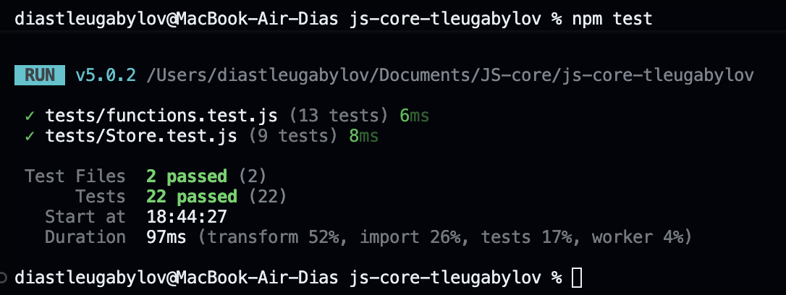

# js-core-tleugabylov — Dias Tleugabylov
A JavaScript project with utility functions, closures, classes, inheritance, and unit tests.

## Installation and tests

```bash
npm install
npm test
```
.Implemented functions

.unique(arr) removes duplicate values.

.groupBy(arr, keyFn) groups items by a calculated key.

.chunk(arr, size) divides an array into smaller arrays.

.deepClone(obj) copies objects, arrays, and Date values.

.memoize(fn) caches function results.

.counter() creates a private counter.

## Store classes

Store manages items containing name, price, and qty. It supports adding, removing, finding, and calculating the total price. SortedStore extends Store and returns items sorted by name.

## Closures in my code

I used closures in `memoize` and `counter`. The `memoize` function remembers its cache between calls. If the same value is passed again, it returns the saved result. The `counter` function remembers the `count` variable. Its methods can increase, decrease, or show the value. The value stays private because it is inside the function.
## Test results


## AI use

I used ChatGPT/Codex for help with the project structure, tests, and checking my code. I read the code and tested how it works.